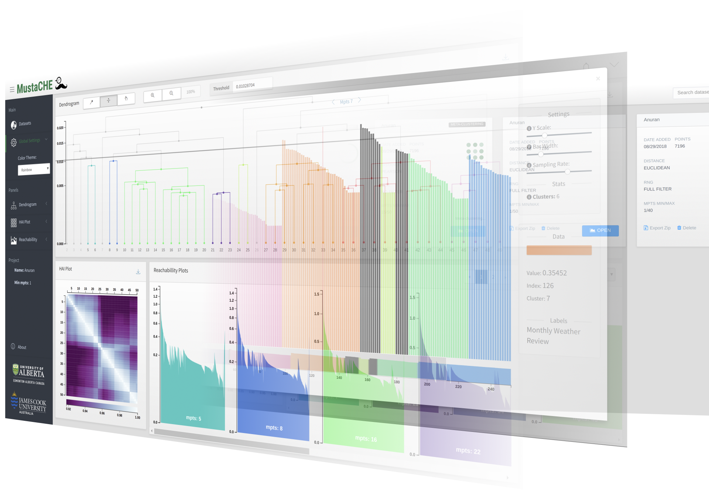
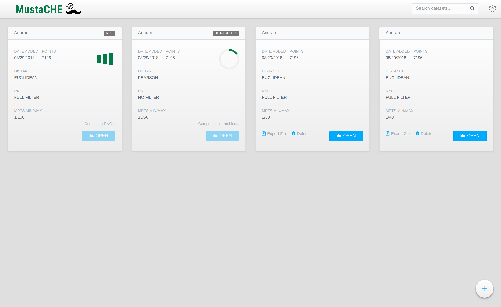
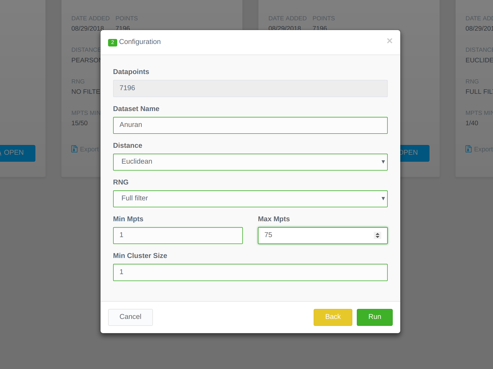
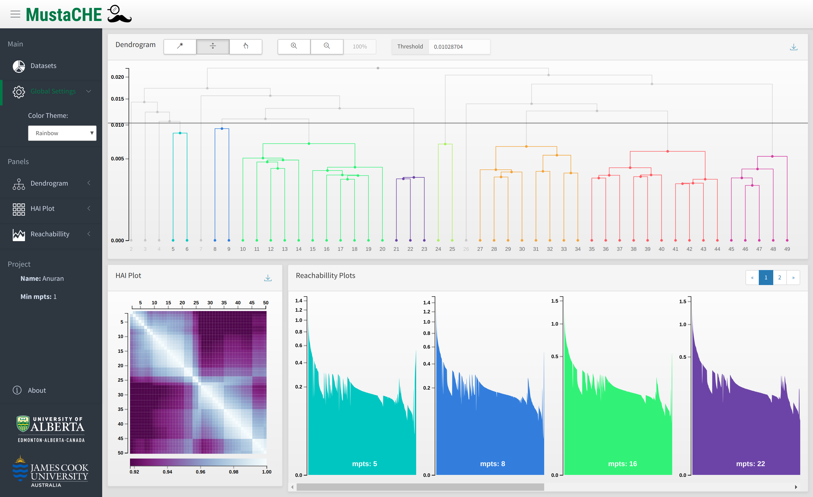

MustaCHE | Multiple Clustering Hierarchies Explorer
==============

----

MustaCHE, a tool that allows analysis and exploration of multiple clustering hierarchies (w.r.t. a set of mpts values) in an interactive and visual manner. Its main overall goals are to assist the user to (1) (visually) find “good” valuesfor mpts and (2) to understand which cluster structures arepresent w.r.t. different density parameters in the data. 

1. `Examples & Usage <#1-examples--usage>`_
2. `Installation <#2-installation--setup>`_
3. `Background & Research <#3-background--research>`_
4. `Troubleshooting <#4-troubleshooting-problems>`_

|forthebadge made-with-python|

1. Examples & Usage
===================

Home
-------------------------------------

.. image:: docs/add_file.png

Dashboard
-------------------------------------

.. image:: docs/reach.png

* **SIDE BAR** — Info about SIDE BAR

* **DENDROGRAM** — Info about DENDROGRAM

* **HAI PLOT** — Info about HAI PLOT

* **REACHABILLITY PLOTS** — Info about REACHABILLITY PLOTS

 
* **FULL REACHABILLITY PLOT** — Info about REACHABILLITY PLOTS

2. Installation & Setup
=======================

Docker [ recommended ]
-------------------------------------

Manual Installation [developers]
-------------------------------------

3. Background & Research
========================

4. Troubleshooting Problems
===========================

.. |forthebadge made-with-python| image:: http://ForTheBadge.com/images/badges/made-with-python.svg
   :target: https://www.python.org/

.. |License Type| image:: https://img.shields.io/badge/license-AGPL-blue.svg
    :target: https://github.com/alexjc/neural-enhance/blob/master/LICENSE

.. |Project Stars| image:: https://img.shields.io/github/stars/alexjc/neural-enhance.svg?style=flat
    :target: https://github.com/alexjc/neural-enhance/stargazers
    
.. |Python versions| image:: https://img.shields.io/badge/<SUBJECT>-<STATUS>-<COLOR>.svg
   :target: 
